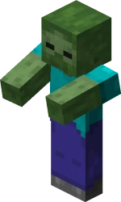
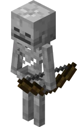
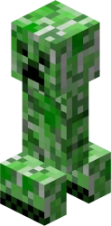
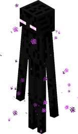
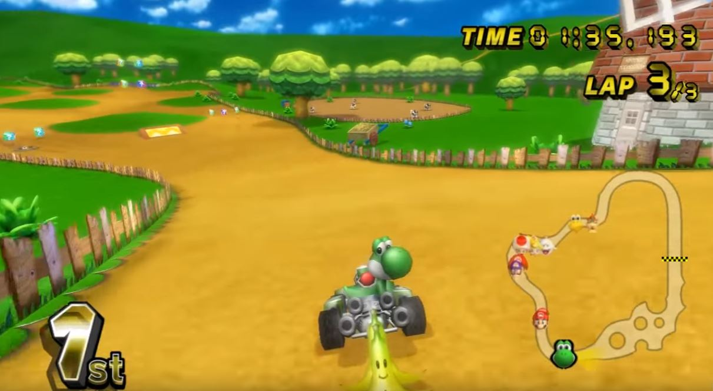

# 1.3 Research

## Minecraft

<figure><figcaption></figcaption></figure>

### Overview

Minecraft is a sandbox video game developed by Mojang [(Coldewey, 2011)](https://techcrunch.com/2011/01/15/a-brief-explanation-of-why-minecraft-matters/) and acquired by Microsoft in 2014 [(Etherington, 2014)](https://techcrunch.com/2014/09/15/microsoft-has-acquired-minecraft/?guccounter=1). Players can mine blocks and build with them, and use the items they gather as "ingredients" to craft other items for game progression. There are two game modes: creative and survival. In survival, players must gather their own resources and food whilst fighting monsters. This is in contrast to creative, players are given infinite resources and do not have to eat to survive [(Washington Post, 2013)](https://www.washingtonpost.com/lifestyle/kidspost/what-is-minecraft/2013/03/14/98c54514-8a57-11e2-a051-6810d606108d\_story.html). Minecraft has been released on PC, Mac [(Minecraft.net, 2022)](https://www.minecraft.net/en-us/store/minecraft-java-bedrock-edition-pc), Xbox 360/One/Series X, Playstation 3/4/5 [(Attack of the Fanboy, 2013)](https://attackofthefanboy.com/news/4j-studios-confirmed-handling-minecraft-ps4/), Wii U [(Craddock, 2018)](https://www.nintendolife.com/news/2018/12/minecraft\_wii\_u\_edition\_gets\_its\_last\_ever\_update\_developer\_4j\_reminisces\_over\_last\_gen\_consoles), Nintendo 3DS [(Minecraft.net, 2019)](https://www.minecraft.net/en-us/article/new-nintendo-3ds-update), Android, iOS [(Schramm, 2011)](https://www.engadget.com/2011-11-16-minecraft-pocket-edition-out-on-ios-today.html), Windows Phone [(Davies, 2017)](https://www.minecraft.net/en-us/article/upgrade-windows-phone-players), and Raspberry Pi [(Upton, 2014)](https://www.raspberrypi.org/blog/using-minecraft-raspberry-pi-edition-to-get-kids-computing/).

### Common monsters

#### Zombie

<figure><figcaption>
A zombie
</figcaption></figure>

Zombies are monsters in Minecraft that only spawn in the dark and attack the player close-up. They have 10 hearts, inflict a low amount of damage on the player, and will burn when exposed to daylight [(DigMinecraft, 2015)](https://www.digminecraft.com/mobs/zombie.php). On death, a zombie will drop up to 2 rotten flesh [(GameGuide, 2012)](https://www.game.guide/minecraft-zombies).&#x20;

#### Skeleton

<figure><figcaption>
A skeleton
</figcaption></figure>

Skeletons are monsters that fire arrows with a bow at the player. Like zombies, they only spawn in the dark and burn in daylight [(Thakur, 2022)](https://www.wepc.com/gaming/minecraft/all-you-need-to-know-about-the-minecraft-skeleton/). Upon death, skeletons can drop up to 2 bones and arrows, and there is a small chance of it dropping any of its gear such as its bow or helmet [(IGN, n.d.)](https://www.ign.com/wikis/minecraft/Skeleton).

#### Creeper

<figure><figcaption>
A creeper
</figcaption></figure>

Creepers originated from a failed attempt to implement the pig, after Minecraft creator Notch mixed up the height and length values [(Hillier, 2014)](https://www.vg247.com/minecraft-creepers-happy-birthday). They will silently move towards the player, giving only a short hiss before they explode, dealing a great amount of damage, sometimes killing the player, along with destroying blocks close to the explosion [(Brown, 2021)](https://screenrant.com/minecraft-creeper-origin-design-how-avoid-mob-attack/).

#### Enderman

<figure><figcaption>
An Enderman
</figcaption></figure>

Endermen spawn in all three dimensions: The Overworld, the Nether, and the End [(Geere, 2021)](https://www.minecraft.net/en-us/article/around-block--warped-forest). They are neutral towards the player, meaning they only attack upon being provoked — in the Enderman's case, this means when the player either attacks it or looks directly at it [(wikiHow, 2021)](https://www.wikihow.com/Avoid-an-Enderman-Attack-in-Minecraft). They attack by teleporting towards the player and trying to hit them [(DigMinecraft, 2015)](https://www.digminecraft.com/mobs/enderman.php). Endermen have 20 hearts and sometimes drop Ender Pearls which can be used by the player to teleport a certain range.

### Health and hunger bars

<figure><figcaption></figcaption></figure>

#### Health bar

The health bar displays how much damage the player is able to take before dying. It is split into 10 hearts, each representing 2 health points [(Burkett, 2022)](https://www.sportskeeda.com/minecraft/minecraft-s-health-hunger-bars-explained). Health can be replenished with a full or near-full hunger bar or through potions such as healing and regeneration [(Maillot, 2022)](https://gamerant.com/minecraft-every-status-effect-how-to-get-them/).

#### Hunger bar

The hunger bar is split into 10 drumsticks, each representing 2 hunger points. The player can regenerate health when the hunger the hunger bar is at 9 drumsticks (18 points) or more [(Burkett, 2022)](https://www.sportskeeda.com/minecraft/minecraft-s-health-hunger-bars-explained). The bar depletes as the player performs certain activities in the game such as sprinting. It can be replenished by eating food. Depending on the difficulty, running out of hunger can be fatal [(Maillot, 2022)](https://gamerant.com/minecraft-how-hunger-works/).

### Singleplayer and multiplayer modes

Minecraft can be played alone or with others. On the PC/Mac Edition, players can join a public server, play with others on the same network, or purchase a "Realm" hosted by Mojang [(Witman, 2022)](https://www.businessinsider.com/guides/tech/how-to-play-multiplayer-in-minecraft-java).

Some of the most well-known Minecraft servers have hundreds of thousands of players logging in every day to play, such as Hypixel [(Hays, 2022)](https://www.sportskeeda.com/minecraft/10-best-minecraft-servers-play-2022).

### Controls

<figure><figcaption>
Controls for Minecraft PC Edition <a href="https://blog.connectedcamps.com/guides/get-started-in-minecraft/controls/">(Connected Camps, n.d.)</a>
</figcaption></figure>

### Features



| Feature                        | Justification                                                                                                                                                                                  |
| ------------------------------ | ---------------------------------------------------------------------------------------------------------------------------------------------------------------------------------------------- |
| Zombie, skeleton, and creepers | These will feature in the Monster Army power-up and attack players.                                                                                                                            |
| TNT and fireballs              | TNT and fireballs can be used by the player to hurt other players.                                                                                                                             |
| Health points                  | This will add an element of challenge to the game as the player will have to avoid getting hurt.                                                                                               |
| Potions                        | In case the player does get injured, they will need a means to replenish their health. Healing potions will let them do this. I will also have a speed potion to temporarily boost the player. |
| WSAD controls                  | These controls are used in many PC games so many gamers will be familiar with them and they will be easy to pick up.                                                                           |



| Feature    | Justification                                                                                                                                                       |
| ---------- | ------------------------------------------------------------------------------------------------------------------------------------------------------------------- |
| Enderman   | It would take too long to implement a feasible teleportation algorithm.                                                                                             |
| Crafting   | There would be no need for crafting in my game. Also, it is a racing game where the player constantly needs to pay attention so they would have no time to do this. |
| Building   | Same reason as crafting.                                                                                                                                            |
| Hunger bar | The game is more challenging if the only way to regenerate health points is through drinking potions.                                                               |



## Mario Kart Wii

<figure><figcaption></figcaption></figure>

### Overview

Mario Kart Wii is a racing action game for the Wii console where players can choose from a wide variety of Nintendo characters, karts, and motorbikes, and compete in races or battles with AI or other players [(Nintendo, 2008)](https://www.nintendo.co.uk/Games/Wii/Mario-Kart-Wii-281848.html).&#x20;

### Game modes

Mario Kart Wii features four game modes: singleplayer, multiplayer, Nintendo WiFi, and Mario Kart channel [(Barker, 2008)](https://www.nintendolife.com/reviews/2008/04/mario\_kart\_wii\_wii). The singleplayer mode allows one player to play against AI cars and multiplayer allows up to four players to share the screen on the same Wii console to play against both one another and AI cars.&#x20;

The Nintendo WiFi mode allows players to play with others beyond their own console. On selecting the mode, the player is asked whether they want to play with others anywhere in the world or just in their own continent. After this they are prompted to choose a character and randomly added into a room.&#x20;

<figure><figcaption>
Selection screen allows the player to choose if they want to play with anyone in the world, anyone in their region, or just friends
</figcaption></figure>

### Item boxes

<figure><figcaption>
What item boxes look like
</figcaption></figure>

In Mario Kart Wii item boxes can be found around the map. When a player passes through an item box they receive a random item. The position of the race the player is in determines the likelihood they will receive a certain item. For example, players far behind are more likely to receive a bullet bill or super star, which will help them catch up [(Super Mario Wiki, 2023)](https://www.mariowiki.com/Item\_Box).

#### Items

* Mushroom: Give the user a speed boost.
* Mega Mushroom: Enlarge the user allowing them to squash other cars.
* Green shell: Travels in a straight line bouncing off walls, if a car is hit they fall over.
* Red shell: Travels towards the car in front of the user, breaks if it hits a wall.
* Spiny shell: Flies towards whoever is 1st place and produces a giant blue explosion, throwing any nearby cars into the air.
* Banana: Causes any car who runs over it to spin around for a few seconds.
* Bob-omb: Explodes causing any car nearby to lose control for a few seconds. If it hits a car it will explode immediately, otherwise it will after a few seconds.
* Fake Item Box: Looks like an item box but red and the question mark is upside down. Any car that drives into it will lose control for a few seconds.
* Bullet Bill: Transforms the user into a fast rocket. Invincible to everything, unstoppable, and is able to knock over cars in the way.
* Star: Increased the maximum speed and acceleration of the user and makes them invincible. Allows the user to knock over other cars.
* Blooper: Sprays black ink over the screens of all other cars, preventing them seeing the track clearly. For AI cars, this will make them drive slower.
* POW Block: Causes an earthquake that affects all other cars, causing them to lose control temporarily. Does not affect cars in the air while it happens.
* Thunder Cloud: Cloud hovers above the user and acceleration and speed is temporarily increased, but after a short period it strikes the user with lightning shrinking them. It can be passed onto other cars by bumping into them before the lightning.
* Lightning: Fires a lightning bolt on all other cars shrinking them and reducing their speed. If a car is in the air they will fall down. Cars further ahead will be shrunk for longer.

[(StrategyWiki, 2021)](https://strategywiki.org/wiki/Mario\_Kart\_Wii/Items)

### Controls

The player can steer their car by tilting the Wii remote left and right [(Hinkle, 2008)](https://www.engadget.com/2008-04-02-a-note-about-control-options-in-mario-kart-wii.html). To accelerate press 2 and to brake press 1 [(Game Guide, 2022)](https://www.game.guide/mario-kart-wii-controls). To use an item, press any button on the control pad, however to throw a projectile item such as a red shell forward press the upward button and to throw it behind press the downward one [(IGN, 2017)](https://www.ign.com/wikis/mario-kart-wii/Basics).

### Cups and races

<figure><figcaption>
Selection of cups in Mario Kart Wii
</figcaption></figure>

<figure><figcaption>
Selection of courses of Mushroom Cup
</figcaption></figure>

In Mario Kart, a cup is defined as a representation of a certain number of courses [(Super Mario Wiki, 2023)](https://www.mariowiki.com/Cup). In Mario Kart Wii, there are 8 cups each consisting of 4 courses [(Mario Kart Wii Wiki, 2022)](https://mariokartwii.fandom.com/wiki/Cups). Each course looks vastly different to one another and has different obstacles and terrain.

### Features



| Feature                                  | Justification                                                                                                                                                          |
| ---------------------------------------- | ---------------------------------------------------------------------------------------------------------------------------------------------------------------------- |
| Online multiplayer                       | I want players to be able to play together across different networks. Players will be able to play in rooms of up to five.                                             |
| Different levels                         | The game should be engaging and take a while for the players to complete. I will add in four levels and at the end the player's overall performance will be evaluated. |
| Item boxes                               | There will be power-ups in my game so these can serve as a way to obtain them.                                                                                         |
| Individual leaderboards after each level | This will let the players know how well they did in the race and how many points they receive.                                                                         |
| Final leaderboard after finishing game   | This will let the players know how well they did overall by using their points.                                                                                        |
| Racing                                   | This makes the game competitive and more exciting as players must constantly try to be ahead of one another.                                                           |



| Feature       | Justification                                                                                                                  |
| ------------- | ------------------------------------------------------------------------------------------------------------------------------ |
| Multiple cups | This would take too much time to implement for a project of this scale.                                                        |
| AI cars       | I want my game to be multiplayer-oriented so a singleplayer mode with AI cars would be unsuitable for the purpose of the game. |


