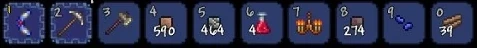
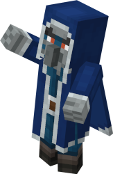
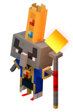

# 1.3 Research

## Minecraft

<figure><figcaption></figcaption></figure>

### Overview

Minecraft is a sandbox video game developed by Mojang [(Coldewey, 2011)](https://techcrunch.com/2011/01/15/a-brief-explanation-of-why-minecraft-matters/) and acquired by Microsoft in 2014 [(Etherington, 2014)](https://techcrunch.com/2014/09/15/microsoft-has-acquired-minecraft/?guccounter=1). Players can mine blocks and build with them, and use the items they gather as "ingredients" to craft other items for game progression. There are two game modes: creative and survival. In survival, players must gather their own resources and food whilst fighting monsters. This is in contrast to creative, players are given infinite resources and do not have to eat to survive [(Washington Post, 2013)](https://www.washingtonpost.com/lifestyle/kidspost/what-is-minecraft/2013/03/14/98c54514-8a57-11e2-a051-6810d606108d\_story.html). Minecraft has been released on PC, Mac [(Minecraft.net, 2022)](https://www.minecraft.net/en-us/store/minecraft-java-bedrock-edition-pc), Xbox 360/One/Series X, Playstation 3/4/5 [(Attack of the Fanboy, 2013)](https://attackofthefanboy.com/news/4j-studios-confirmed-handling-minecraft-ps4/), Wii U [(Craddock, 2018)](https://www.nintendolife.com/news/2018/12/minecraft\_wii\_u\_edition\_gets\_its\_last\_ever\_update\_developer\_4j\_reminisces\_over\_last\_gen\_consoles), Nintendo 3DS [(Minecraft.net, 2019)](https://www.minecraft.net/en-us/article/new-nintendo-3ds-update), Android, iOS [(Schramm, 2011)](https://www.engadget.com/2011-11-16-minecraft-pocket-edition-out-on-ios-today.html), Windows Phone [(Davies, 2017)](https://www.minecraft.net/en-us/article/upgrade-windows-phone-players), and Raspberry Pi [(Upton, 2014)](https://www.raspberrypi.org/blog/using-minecraft-raspberry-pi-edition-to-get-kids-computing/).

### Common monsters

#### Zombie

<figure><figcaption>
A zombie
</figcaption></figure>

Zombies are monsters in Minecraft that only spawn in the dark and attack the player close-up. They have 10 hearts, inflict a low amount of damage on the player, and will burn when exposed to daylight [(DigMinecraft, 2015)](https://www.digminecraft.com/mobs/zombie.php). On death, a zombie will drop up to 2 rotten flesh [(GameGuide, 2012)](https://www.game.guide/minecraft-zombies).&#x20;

#### Skeleton

<figure><figcaption>
A skeleton
</figcaption></figure>

Skeletons are monsters that fire arrows with a bow at the player. Like zombies, they only spawn in the dark and burn in daylight [(Thakur, 2022)](https://www.wepc.com/gaming/minecraft/all-you-need-to-know-about-the-minecraft-skeleton/). Upon death, skeletons can drop up to 2 bones and arrows, and there is a small chance of it dropping any of its gear such as its bow or helmet [(IGN, n.d.)](https://www.ign.com/wikis/minecraft/Skeleton).

#### Creeper

<figure><figcaption>
A creeper
</figcaption></figure>

Creepers originated from a failed attempt to implement the pig, after Minecraft creator Notch mixed up the height and length values [(Hillier, 2014)](https://www.vg247.com/minecraft-creepers-happy-birthday). They will silently move towards the player, giving only a short hiss before they explode, dealing a great amount of damage, sometimes killing the player, along with destroying blocks close to the explosion [(Brown, 2021)](https://screenrant.com/minecraft-creeper-origin-design-how-avoid-mob-attack/).

#### Enderman

<figure><figcaption>
An Enderman
</figcaption></figure>

Endermen spawn in all three dimensions: The Overworld, the Nether, and the End [(Geere, 2021)](https://www.minecraft.net/en-us/article/around-block--warped-forest). They are neutral towards the player, meaning they only attack upon being provoked — in the Enderman's case, this means when the player either attacks it or looks directly at it [(wikiHow, 2021)](https://www.wikihow.com/Avoid-an-Enderman-Attack-in-Minecraft). They attack by teleporting towards the player and trying to hit them [(DigMinecraft, 2015)](https://www.digminecraft.com/mobs/enderman.php). Endermen have 20 hearts and sometimes drop Ender Pearls which can be used by the player to teleport a certain range.

### Health and hunger bars

<figure><figcaption></figcaption></figure>

#### Health bar

The health bar displays how much damage the player is able to take before dying. It is split into 10 hearts, each representing 2 health points [(Burkett, 2022)](https://www.sportskeeda.com/minecraft/minecraft-s-health-hunger-bars-explained). Health can be replenished with a full or near-full hunger bar or through potions such as healing and regeneration [(Maillot, 2022)](https://gamerant.com/minecraft-every-status-effect-how-to-get-them/).

#### Hunger bar

The hunger bar is split into 10 drumsticks, each representing 2 hunger points. The player can regenerate health when the hunger the hunger bar is at 9 drumsticks (18 points) or more [(Burkett, 2022)](https://www.sportskeeda.com/minecraft/minecraft-s-health-hunger-bars-explained). The bar depletes as the player performs certain activities in the game such as sprinting. It can be replenished by eating food. Depending on the difficulty, running out of hunger can be fatal [(Maillot, 2022)](https://gamerant.com/minecraft-how-hunger-works/).

### Singleplayer and multiplayer modes

Minecraft can be played alone or with others. On the PC/Mac Edition, players can join a public server, play with others on the same network, or purchase a "Realm" hosted by Mojang [(Witman, 2022)](https://www.businessinsider.com/guides/tech/how-to-play-multiplayer-in-minecraft-java).

Some of the most well-known Minecraft servers have hundreds of thousands of players logging in every day to play, such as Hypixel [(Hays, 2022)](https://www.sportskeeda.com/minecraft/10-best-minecraft-servers-play-2022).

### Controls

<figure><figcaption>
Controls for Minecraft PC Edition <a href="https://blog.connectedcamps.com/guides/get-started-in-minecraft/controls/">(Connected Camps, n.d.)</a>
</figcaption></figure>

### Features



| Feature                        | Justification                                                                                                                                                                                                      |
| ------------------------------ | ------------------------------------------------------------------------------------------------------------------------------------------------------------------------------------------------------------------ |
| Zombie, skeleton, and creepers | These will randomly spawn on the race track and attempt to hurt the players.                                                                                                                                       |
| TNT and fireballs              | TNT and fireballs can be used by the player as weapons against monsters and other players.                                                                                                                         |
| Health points                  | This will add an element of challenge to the game as the player will have to avoid getting hurt.                                                                                                                   |
| Potions                        | In case the player does get injured, they will need a means to replenish their health. Healing potions will let them do this. I will also have potions such as strength and speed to temporarily boost the player. |
| WSAD controls                  | These controls are used in many PC games so many gamers will be familiar with them and they will be easy to pick up.                                                                                               |



| Feature    | Justification                                                                                                          |
| ---------- | ---------------------------------------------------------------------------------------------------------------------- |
| Enderman   | It would take too long to implement a feasible teleportation algorithm.                                                |
| Crafting   | There would be no need for crafting in my game. Also, it is a racing game so the player would have no time to do this. |
| Building   | Same reason as crafting.                                                                                               |
| Hunger bar | The game is more challenging if the only way to regenerate health points is through drinking potions.                  |



## Terraria

<figure><figcaption></figcaption></figure>

Terraria is a 2D sandbox video game developed by Re-Logic. It has many similarities with Minecraft, such as being a block-based sandbox and being themed around building and exploration [(Brown, 2021)](http://www.differencebetween.net/technology/difference-between-minecraft-and-terraria). However, the two games differ in various ways. Terraria has a clear sense of progression as players must expand their base, acquire better weaponry, and fight bosses. This contrasts to Minecraft, where the end goal is much more open to interpretation as the game allows players to do whatever they want [(Sepulveda, 2021)](https://www.sportskeeda.com/minecraft/terraria-vs-minecraft-5-major-differences-games). Additionally, Terraria is more oriented towards adventure and combat, whereas Minecraft allows for more creative building and player control over game progression [(Zalace, 2023)](https://www.thegamer.com/terraria-vs-minecraft-which-game-is-better).

### Side-scrolling

A side-scroller is a type of video game where the camera moves in accordance to how the player is moving, so that the player sprite is always visible in a certain position on the screen [(Rouse, 2011)](https://www.techopedia.com/definition/27153/side-scroller). Side-scrolling is implemented in Terraria so that the player is always in the horizontal centre of the screen. This is so the player always has a good view of their surroundings.

### Hotbar

<figure><figcaption>
A hotbar layout in Terraria
</figcaption></figure>

The hotbar is a panel of up to 10 items chosen by the player that can be accessed with the number keys on the keyboard. Typically, players tend to put weapons, tools, blocks, and potions in their hotbar [(Greenfield, 2020)](https://www.gamegrin.com/articles/terraria-how-to-navigate-the-inventory-screen).

### Background walls

<figure><figcaption>
A player's house in Terraria that uses background walls
</figcaption></figure>

Background walls are tiles that provide a background on top of the existing background of the biomes and protect structures from enemy invasions [(Mančinskas, n.d.)](https://www.gamespedition.com/pc-games/indie-games/indie-adventure-games/terraria/terraria-tips-tricks-strategy-guide/how-to-make-walls-in-terraria).

### Enemies

### Features



| Feature        | Justification                                                                           |
| -------------- | --------------------------------------------------------------------------------------- |
| Side-scrolling | This makes it easier for the player to keep track of themselves and their surroundings. |
|                |                                                                                         |



| Feature                          | Justification                                                                                                                         |
| -------------------------------- | ------------------------------------------------------------------------------------------------------------------------------------- |
| Automatic regeneration of health | The player should have to work to regenerate health because this will be more challenging than having it automatically done for them. |



## Minecraft Dungeons

<figure><figcaption></figcaption></figure>

Minecraft Dungeons is a dungeon-crawler video game based in the world of its sandbox predecessor, Minecraft [(Watts, 2020)](https://www.pcgamer.com/minecraft-dungeons-review/). The player must venture through levels to defend villagers, fight monsters, and beat the final boss of the game, the Arch-Illager [(Minecraft.net, 2021)](https://www.minecraft.net/en-us/about-dungeons). Although it is based in the world of Minecraft, there are several key differences in the style of gameplay. Minecraft Dungeons lacks the ability to build [(Jensen, 2020)](https://uk.pcmag.com/gaming-gear/127137/minecraft-dungeons-is-here-but-what-is-minecraft-without-building) and unlike the original Minecraft, which was a sandbox game with freedom to play however one wants, Minecraft Dungeons is a dungeon crawler with the goal of progressing and adventuring through multiple stages [(Greene, 2022)](https://www.sportskeeda.com/minecraft/minecraft-vs-minecraft-dungeons-how-different-two-games).

### Enemies

#### Blastling

<figure><figcaption></figcaption></figure>

The Blastling is a monster in Minecraft Dungeons' Echoing Void DLC [(Joy, 2021)](https://collider.com/minecraft-dungeons-echoing-void-release-date-trailer/). It rapidly fires projectiles from its arms at the player. It fires projectiles at a fast speed and large volume, presenting a challenge in the End dimension [(Landin, 2021)](https://www.minecraft.net/en-us/article/meet-enderlings).

#### Iceologer

<figure><figcaption></figcaption></figure>

The Iceologer is a monster in Minecraft Dungeons' Creeping Winter DLC [(thebluecrusaderYT, 2020)](https://www.curseforge.com/minecraft/mc-mods/iceologer). It was originally one of three options in Minecraft's annual mob vote but lost the vote [(Harris, 2020)](https://www.pcgamesn.com/minecraft/iceologer).

### Final Boss (Arch-Illager)

<figure><figcaption></figcaption></figure>

The Arch-Illager is Minecraft Dungeon's primary antagonist and its final boss [(Maher, 2020)](https://www.gamespot.com/articles/how-to-defeat-archillager-in-minecraft-dungeons-fi/1100-6477806/). Fighting him takes place in two stages. In the first stage, the Arch-Illager throws orbs which deal significant damage to the player upon hit, as well as summon mobs such as vindicator illagers. The second stage happens when the Arch-Illager is low on health. He spawns a Redstone Golem, which puts down more mines than others encountered throughout the game [(Puleo, 2020)](https://gamerant.com/minecraft-dungeons-arch-illager/).&#x20;

### Multiplayer

Minecraft Dungeons includes multiplayer support both online and on the local network [(Irwin, 2020)](https://www.rockpapershotgun.com/minecraft-dungeons-multiplayer-coop-modes-explained). Players can play in groups of up to four and although Dungeons lacked support for cross-platform multiplayer when it was released, a subsequent update allowed players to play together regardless of platform differences [(Boddy, 2020)](https://www.windowscentral.com/minecraft-dungeons-guide-cross-play).&#x20;



| Feature                                            | Justification                                                         |
| -------------------------------------------------- | --------------------------------------------------------------------- |
| Online multiplayer of up to four people            | Four is a reasonable amount of players, allows more social engagement |
| Better armour and weapons as the player progresses | Allows the player to withstand deadlier monsters and bosses           |
| Final boss                                         | Challenge to work towards                                             |



| Feature    | Justification                          |
| ---------- | -------------------------------------- |
| Skin packs | Too complicated to implement           |
| Golems     | Not as challenging                     |
| Backstory  | Take too much time to devise and write |



## Mario Kart Wii

<figure><figcaption></figcaption></figure>

Mario Kart Wii is a multiplayer-oriented racing game from the Mario Kart series made for the Wii console.&#x20;

Item Boxes

Item boxes are scattered across the map. They are multicoloured shiny blocks with a question mark inside of them. When a player collides with an item box, they are&#x20;
