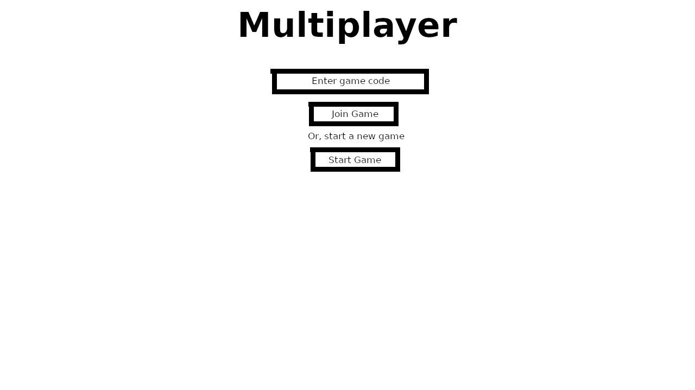

# 1.4a Features of Proposed Solution

## Mechanics

### Controls for movement

I have decided to use the WSAD keys for the player to move their car about. These are used in most PC games, therefore many players will be familiar with these controls.&#x20;

* W: Move the car forward.
* S: Reverse the car.
* A: Turn the car left.
* D: Turn the car right.

I will attempt to simulate the physics of a real car in the game. To do this, I will add speed and acceleration properties to the car sprite. The speed will be set to 0 at the start and revert back to this if the player stops moving it. While the player presses down W to move forward, the acceleration will continually be added to the speed. Similarly, pressing down S to reverse will continually deduct the acceleration from the speed. This gives driving the car a more realistic feel.

### Health system

The player will start the game with ten health points, each one represented by a red heart. The health points the player has lost will be represented by dark grey hearts. For example, if the player has 7 health points, there will be 7 red hearts and 3 grey hearts. Players will lose health if they are caught in an explosion resulting from TNT, a fireball, or a creeper, or if they are hit by a zombie or a skeleton's arrow.

If the player runs out of healthpoints, the screen will go dark and over 10 seconds gradually get lighter. The player will be unable to move their car during this time. Every second a health point will be restored. Monsters will not attack the player until they have returned to full health.

### Side-scrolling

<figure><figcaption>
In this Flappy Bird game, the player's character is always on the left side of the screen
</figcaption></figure>

A common characteristic of 2D games is for the camera to continually follow the player so that they are in a certain position of the screen, often the far left or centre. This means the player will never lose track of their character in the game no matter where they go on the map. In my game, whenever the player's coordinates are updated, the camera will adjust so that the road is always in the middle of the screen and the player's car is near the bottom.

<figure><figcaption>
Drawing of how the road and car will be positioned on the screen
</figcaption></figure>

## User Interface&#x20;

### Title screen

<figure><figcaption>
Drawing of title screen layout
</figcaption></figure>

My game's title screen will be simple. At the top middle of the screen it will have the title of the game. In the centre I will have play and sign out buttons, and text underneath displaying the player's username.&#x20;

The game will only be playable to those signed in. Those not signed in will be shown a different screen with a brief explanation they must be signed in to play and a button which redirects them to the login form.

<figure><figcaption></figcaption></figure>

My game's title screen will be simple and show the title of the game followed by buttons to Play and Sign Out and with text displaying the username of the player. If the player is not signed in, they will instead be shown a message saying they need to sign in and a button which takes them to the sign in page.

### Multiplayer

<figure><figcaption></figcaption></figure>

My game will be an online multiplayer game. Players can create a room which will generate a code which up to four more people can use to join the room. When any player clicks to start the game, all players will move onto the gameplay itself. Each player will be assigned a car which they control with WSAD. Whenever a player performs an action such as movement or activating a combat power-up such as a fireball, this will be broadcast to all players' games.

## Chests and power-ups

Chests will be scattered across the race map. When a player collides with a chest, a power-up is randomly selected and given to the player. I want power-ups in my game as they can be beneficial if the player is in a difficult situation such as low health or very far behind other players. Additionally, they can be useful in distracting or damaging other players.

The player can activate a power-up by pressing shift. I plan on including the following power-ups:

* Potion of Speed: Doubles maximum speed for 10 seconds.
* Potion of Regeneration: Replenishes 1 health point every second for 10 seconds.
* Potion of Healing: Replenishes 3 health points instantly upon usage.
* TNT: Placed behind the player using it. When other players come within close range of the TNT, it explodes, dealing 8 health points of damage.
* Fireball: Allows the player to click anywhere in front of them to fire it. If the fireball hits another player, they lose 4 health points.
* Monster Army: Spawns up to five monsters (zombies, skeletons, creepers) who chase after other players on the race track. The army disappears after 30 seconds.

The power-up the player currently has waiting will show in a box in the top left corner of the screen.

<figure><figcaption></figcaption></figure>

## Enemies

I want my game to have non-player enemies so I have decided I will implement the "Monster Army" power-up to spawn a group of three different types of non-player enemies: zombie, skeleton, and creeper. These enemies will attack nearby players who are not the player that originally spawned them. Rather than fighting them, the purpose of players is to avoid them as this can be useful as a distraction. The monsters disappear after 30 seconds.

* Zombie: Runs after passing players attempting to hit them close up. Being hit inflicts 1 point of damage.
* Skeleton: Shoots arrows after passing players. Being hit inflicts 1 point of damage.
* Creeper: Explodes when coming within close proximity of a player. Being in this explosion inflicts 4 points of damage.

### Player detection

<figure><figcaption></figcaption></figure>

Monsters will attempt to attack all players except the player that spawned them. They will continually check for players entering within a certain radius of them.&#x20;

Once a player is detected, the monster needs to find out how to get to the player, or in the case of the skeleton, where to shoot its arrows. The game will imagine a triangle: the opposite side will be the distance between the monster's Y co-ordinate and the player's Y co-ordinate, while the adjacent will be the distance between the two X co-ordinates. These two distances will be used along with tan to work out the angle between the opposite and the hypotenuse, which is a single straight line between the monster and the player. Finally, the game will use sin and cos functions to calculate the speed at which the monster must move at to get to the player.&#x20;

## Levels

My game will have four levels similar to Mario Kart cups having four races. They will mostly stay the same in terms of features and difficulty but take place in different environments based on Minecraft biomes.&#x20;

* Level 1: Set in forest biome, road made of dirt and surrounded by grass and oak trees.
* Level 2: Set in desert biome, road made of sandstone and surrounded by sand and cacti.
* Level 3: Set in mesa biome, road made of terracota and surrounded by red sand and dead bush.
* Level 4: Set in snowy mountains biome, road made of stone and surrounded by snow and spruce trees.

After each level a leaderboard will be displayed showing how each player performed in that individual level. After five seconds of the leaderboard showing the game will either move onto the next level or a final leaderboard ranking players based on their overall performance.

### World Generation

When a new room is created, the server will generate worlds for each of four levels with the road and surrounding block as the base. After, the generator will randomly scatter the prop off of the road and randomly scatter chests on the road. This will make the gameplay feel more unique each time the game is played.

### World rendering

Worlds will consist of thousands of blocks, which equates to thousands of sprites which the Kaboom.js game engine is unable to handle; rendering all blocks at once will inevitably lead to lag. The way around this is to continually destroy all blocks and render only the blocks that appear within the camera view. The game will calculate the lowest and highest possible X and Y co-ordinates where a player could see the block and then go through each block in the world, checking if it fits within those co-ordinates and rendering it if so.

## Login system

My game will require users to register an account in order to play. I want the process of creating and signing into an account to be simple so I will have one page containing both the login and registration forms that the user can click to switch between.&#x20;

<figure><figcaption></figcaption></figure>

The server will read from and write to a SQLite database which is adequate for storing information about user accounts. For security reasons, passwords will be hashed before they are written to the database when signing up.&#x20;

### Validation

The game must be prepared for the player to attempt to sign into an account using the wrong username or password, or attempt to create an account with a username that is already taken by another. Before logging in or registering the player, the server will check the details to make sure they are valid. In the case they are invalid, a user-friendly error message will be displayed.

## Limitations

### Gamepad support

At the start, I wanted to add support for use of gamepads such as Xbox controllers. Kaboom.js actually supports this by utilising JavaScript's Gamepad API. However, since joining a multiplayer game requires entering in a code, this means I would have to write an on-screen keyboard that works with Kaboom.js. This would take too much time for my project and therefore I have decided to stick with keyboard.

### AI cars and singleplayer mode

My game is multiplayer-oriented and I thought adding a singleplayer mode or AI cars to make up for rooms with less than five players would go against the purpose of the game. Additionally, implementing the relevant sensors and algorithms would take too much time for a project on this scale.

### Terrain generation

I considered adding procedural terrain generation so that the landscape of the worlds looks more unique and exciting each time the player plays the game. However, this would take a lot of time to implement as well as figure out where to put the roads, so I decided to stick with flat terrain. Additionally, Kaboom.js is a 2D game engine and my game takes an above view of the cars, so it would be hard to implement a way of knowing what blocks are higher.
