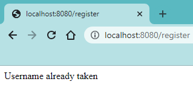

# 2.2.15 Cycle 15: Getting powerups from chest

## Design

In this cycle, I will be writing the code to detect when the player collides with a chest. I will take into account factors such as the player's position in the race implemented in [Cycle 13](2.2.13-cycle-13.md) and the amount of health the player has setup in [Cycle 14](2.2.15-cycle-14.md). This means for example if the player is far behind they are more likely to get a speed potion and if they are low health they are more likely to get a regeneration or healing potion.

### Objectives

* [x] When a player collides with the chest, delete the chest from the map.
* [x] Pick a random power-up from a list.
* [x] Certain factors increase the likelihood of certain power-ups being selected.
* [x] Display the power-up inside a square container in the left of the screen.

### Usability Features

### Key Variables

| Variable Name | Use                                                                |
| ------------- | ------------------------------------------------------------------ |
| chestIndex    | Position of the chest within the world array.                      |
| myCar.powerup | Store the power-up currently being held by the player.             |
| powerups      | Candidates for the player's power-up after colliding with a chest. |

### Pseudocode

```
```

## Development

### Outcome

On completion of this cycle, I have written the code for obtaining power-ups from colliding with a chest. This is important as power-ups serve as a way to distract and injure other players and to boost the player themselves such as in speed or health points. Additionally, I have made it so if the player is far behind or at low health they are likely to get a power-up that helps solve this problem.

Firstly, I have added a golden square container to the top left of the screen. When the player has a power-up, it will display inside. It will display below the health bar.


```javascript
add([
    sprite("powerup_container"),
    area(),
    fixed(),
    z(3),
    pos(20, 70)
])
```


Secondly, I added to the handleCollisions function that I setup in [Cycle 12](2.2.12-cycle-12.md) to detect collisions between the player's car and any chest. If this happens, the game sends an event to the server to delete the chest from the world and broadcast an updated world to all players in the room. Additionally, it will emit an event to the player that collided with the chest telling their game that they opened a chest.


```javascript
car.onCollide("chest", c => {
    const position = {
        x: c.pos.x / 100,
        y: c.pos.y / 100
    }

    socket.emit('delete chest', position)
}
```



```javascript
socket.on('delete chest', position => {
    const chestIndex = rooms[room].worlds[level].findIndex(block => block.x == position.x && block.y == position.y && block.name === "chest")
    
    if (chestIndex != -1) {
        rooms[room].worlds[level].splice(chestIndex, 1)
        socket.emit('open chest')
        io.to(room).emit('load world', rooms[room].worlds[level]) 
    }
})
```


Thirdly, the player who collided with the chest will receive an event to open the chest. This will be where the power-up the player receives is decided. The list of candidates for power-up starts off as empty. Speed is added if the player is not first, healing if the player has less than 8 health, and regeneration if the player has less than five health.


```javascript
socket.on('open chest', () => {
    if (!car.powerup) {
        const powerups = []
        
        const position = parseInt(positionIndicator.text)
        
        if (position > 1) {
            powerups.push("speed")
        }

        if (car.health < 8) {
            powerups.push("healing")
        }

        if (car.health < 5) {
            powerups.push("regeneration")
        } 
```


To add some variety to the possible power-ups, if the number of candidates is less than 3 (which is likely) the game will add random power-ups until the number of candidates is 3. It will make sure to only add a power-up to the candidates once. This includes power-ups like TNT, fireball, and blindness.


```javascript
if (powerups.length < 3) {
    const powerupChoices = ["speed", "healing", "regeneration", "tnt", "fireball", "monster-army", "blindness"]

    for (let i = powerups.length; i < 3; i++) {
        const randomPowerup = powerupChoices[Math.floor(Math.random() * powerupChoices.length)]
        powerups.push(randomPowerup)
        const powerupIndex = powerupChoices.indexOf(randomPowerup)
        powerupChoices.splice(powerupIndex, 1)
    }
}
```


Finally, the game randomly picks a power-up from all the candidates and sets the powerup property of the player's car sprite to it so if the player attempts to use a power-up, the game can determine what power-up the player has and act accordingly. A graphic representing the power-up is then drawn inside the container.


```javascript
const selectedPowerup = powerups[Math.floor(Math.random() * powerups.length)]

myCar.powerup = selectedPowerup

destroyAll("powerup")

add([
    sprite("powerup_" + myCar.powerup),
    area(),
    fixed(),
    z(3),
    pos(28, 78),
    "powerup"
])
```


### Challenges

During this cycle I encountered several errors. In test 1, while chests disappeared when a player collided with them, there was a lot of lag in the moments after the player collided with the chest. This is impractical so I got the server to output each time the "delete chest" event was triggered and found out each time the player collided with a chest the client was emitting the event several times instead of just once.

<figure><figcaption></figcaption></figure>

Normally this would be unusual as the onCollide event for Kaboom.js sprites is only triggered once when the player initially collides with the sprite, however the procedure for rendering my world as set out in Cycle 8 means all blocks are continually destroyed and rendered to prevent lag as the world is large and cannot be rendered all at once without lag. This means the player is colliding with new chests and therefore sending the event to the server several times.

To resolve this, I edited the handling of the delete chest event to only execute the code inside it if the index of the chest was a value other than -1.&#x20;


```javascript
socket.on('delete chest', position => {
    const chestIndex = rooms[room].worlds[level].findIndex(block => block.x == position.x && block.y == position.y && block.name === "chest")
    
    if (chestIndex != -1) {
        rooms[room].worlds[level].splice(chestIndex, 1)
        socket.emit('open chest')
        io.to(room).emit('load world', rooms[room].worlds[level]) 
    }
})
```


The second error I encountered was experienced twice in tests 3 and 4. I initially planned for the game to just continually check if the player had a power-up, destroy the old power-up sprite, and render the new one. However, when I attempted this, it led to an "Uncaught TypeError"

<figure><figcaption></figcaption></figure>


```javascript
onUpdate(() => {
    destroyAll("powerup")
    
    if (myCar.powerup) {
        add([
            sprite("powerup_" + myCar.powerup),
            area(),
            fixed(),
            z(3),
            pos(28, 78),
            "powerup"
        ])
    }
})
```


This was to do with the fact that code in onUpdate starts being executed immediately after the scene is loaded, even before my game had time to render cars, etc. Therefore, the game would attempt to access the "powerup" property of the car sprite before that sprite was even defined, which of course resulted in an error.

I could probably have implemented a check that the car sprite was defined but I decided to abandon the idea of continually refreshing the sprite for the power-up and instead render it once after the power-up was obtained through collision with a chest.


```javascript
const selectedPowerup = powerups[Math.floor(Math.random() * powerups.length)]

myCar.powerup = selectedPowerup

destroyAll("powerup")

add([
    sprite("powerup_" + myCar.powerup),
    area(),
    fixed(),
    z(3),
    pos(28, 78),
    "powerup"
])
```


## Testing

Evidence for testing

### Tests

<table><thead><tr><th width="95">Test</th><th width="158">Instructions</th><th width="171">What I expect</th><th width="174">What actually happens</th><th>Pass/Fail</th></tr></thead><tbody><tr><td>1</td><td>On player collision with chest, delete chest from world.</td><td>When the player collides with the chest, it disappears for all players.</td><td>Chests disappear but there is a lot of lag.</td><td>Fail</td></tr><tr><td>2</td><td>Do not delete the chest if the index is -1.</td><td>No lag when the player collides with a chest.</td><td>As expected</td><td>Pass</td></tr><tr><td>3</td><td>Random select power-up with certain conditions.</td><td>Player given power-up after colliding with chest.</td><td>Uncaught TypeError: Cannot read properties of undefined (reading 'powerup')</td><td>Fail</td></tr><tr><td>4</td><td>Define powerup property of car as null.</td><td>Player given power-up after colliding with chest.</td><td>Same error as before.</td><td>Fail</td></tr><tr><td>5</td><td>Render power-up sprite after selecting power-up.</td><td>Player given power-up after colliding with chest.</td><td>Power-up slightly outside of the container.</td><td>Pass</td></tr><tr><td>6</td><td>Move power-up sprite slightly to the right.</td><td>Power-up fits within the square container.</td><td>As expected</td><td>Pass</td></tr></tbody></table>

### Evidence


Test 1: Chest disappears upon player collision but there is lag



Test 2: Chest disappears upon player collision, no more lag


<figure><figcaption><p>Test 3 and 4: Uncaught TypeError: Cannot read properties of undefined (reading 'powerup')</p></figcaption></figure>


Test 5: Power-up slightly out of container



Test 6: Power-up now fits within container

