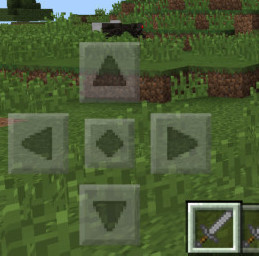

# 1.4a Features of Proposed Solution

## Mechanics

### Controls

Keyboard players will use the WSAD keys to move about. W and S will be used to move while A and D will be used to change direction. The space bar will jump the player. To activate the selected weapon in the hotbar, the player will move the mouse to the enemy they want to use it on and click it; if the enemy is within range, the weapon will activate.

Upon detection of a touchscreen, my game will render five buttons on the left side of the screen for movement and jumping. This is how Minecraft implemented touchscreen support on smartphones and tablets. To activate weapon, the player will tap on the enemy they want to use it on.

<figure><figcaption>
Touch controls in Minecraft on smartphones and tablets
</figcaption></figure>

### Side-scrolling

<figure><figcaption>
In this Flappy Bird game, the player's character is always on the left side of the screen
</figcaption></figure>

A common characteristic of 2D games is for the camera to continually follow the player so that they are in a certain position of the screen, often the far left or centre. This means the player will never lose track of their character in the game no matter where they go on the map. In my game, whenever the player's coordinates are updated, the camera will readjust so that the player is always in the centre of the screen.

## User Interface&#x20;

### Title screen

<figure><figcaption></figcaption></figure>

My game's title screen will be simple and its buttons will depend on whether the player is signed in. For those signed in, it will include buttons to join multiplayer games and access the leaderboard, while those signed out will be limited to singleplayer mode. The furthest down button will either say "Sign In" or "Sign Out" depending on if the player is signed in or not. If the player is signed in, their username will be displayed below the sign out button.

### Multiplayer

<figure><figcaption></figcaption></figure>

My game will have multiplayer of up to four players. To achieve communication between clients, the Node.js module Socket.io will be used. When a new multiplayer game is started, a randomly generated and unique 8-letter ID of numbers and letters will be sent to the backend so it can distinguish between different multiplayer games.&#x20;

<figure><figcaption></figcaption></figure>

The game host and joining players will be presented with a screen displaying the list of other players connected and giving them the option to start the game, if they are the game host, and quit it. If the host quits, control of the game will be ceded to the earliest player to join. If all players leave, the game will cease to exist.

### Leaderboard

<figure><figcaption></figcaption></figure>

The leaderboard will sort the list of players by their record time in ascending order, so that the shortest times are shown first. The top 50 times will be accessible in the leaderboard and the player will be able to see their own position no matter where they are in the leaderboard. The leaderboard will only be accessible to logged in users and only singleplayer records will count for it to be fair.

## Enemies

My game will consist of the following enemies, based on monsters from Minecraft, Minecraft Dungeons, and Terraria:

* Zombie (based on Minecraft Zombie)
* Skeleton (based on Minecraft Skeleton)
* Exploding Terror (based on Minecraft Creeper)
* Cavern Corpse (based on Terraria Undead Miner)
* Blizzard Brute (based on Minecraft Dungeons Iceologer)
* Deadly Inferno (based on Minecraft Dungeons Blastling)

### Player detection

All enemy sprites will have a "hostile" property, which is default set to false. My game will continually check if the player is in 12 tiles proximity of the enemy, and if so, the hostile property will be set to true. When an enemy is hostile, it will calculate if the player is to its left or to its right, then move in that direction to attempt to catch the player.&#x20;

Some enemies such as zombies, skeletons, and exploding terrors will be slower than the player, meaning the player will be able to get away. I plan for the cavern corpse to be the same speed as the player, and the blizzard brute and deadly inferno to be faster. This will make the game more challenging as the player won't easily be able to get away from

### Final boss

The final boss of my game will be the Exploding Mutant. The Exploding Mutant will not attack the player itself, but will summon armies of 2-4 Exploding Terrors that do twice as much damage as normal. The Exploding Mutant will have 100 health points and will regenerate at a rate of 1 health point per second if it has not taken damage for 10 seconds.

## Limitations

### Gamepad support

My game will be made using Kaboom.js, which at the present time lacks support for mapping gamepad keys. Therefore, it will not support gamepad controllers or be playable on games consoles such as the Xbox and PlayStation.
