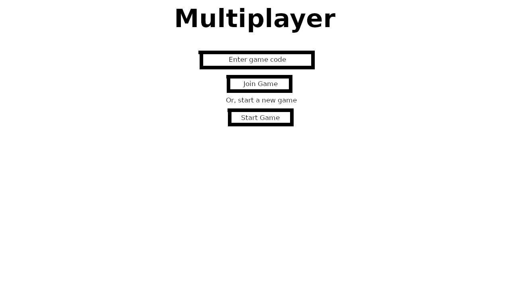

# 1.4a Features of Proposed Solution

## Mechanics

### Controls for movement

Keyboard players will use the WSAD keys to move about. W and S will be used to move while A and D will be used to change direction. The space bar will jump the player.&#x20;

### Health system

The player will start off with 10 health represented by hearts in the top left of the screen, and 3 lives. They will lose health from taking damage from enemies. If they run out of health they will go onto their next life. If they run out of lives, they will lose the game and need to start from the beginning. If they are playing multiplayer, they will be kicked from the game.&#x20;

<figure><figcaption></figcaption></figure>

### Side-scrolling

<figure><figcaption>
In this Flappy Bird game, the player's character is always on the left side of the screen
</figcaption></figure>

A common characteristic of 2D games is for the camera to continually follow the player so that they are in a certain position of the screen, often the far left or centre. This means the player will never lose track of their character in the game no matter where they go on the map. In my game, whenever the player's coordinates are updated, the camera will readjust so that the player is always in the centre of the screen.

## User Interface&#x20;

### Title screen

<figure><figcaption></figcaption></figure>

My game's title screen will be simple and its buttons will depend on whether the player is signed in. For those signed in, it will include buttons to join multiplayer games and access the leaderboard, while those signed out will be limited to singleplayer mode. The furthest down button will either say "Sign In" or "Sign Out" depending on if the player is signed in or not. If the player is signed in, their username will be displayed below the sign out button.

### Multiplayer

<figure><figcaption></figcaption></figure>

My game will have multiplayer of up to four players. To achieve communication between clients, the Node.js module Socket.io will be used. When a new multiplayer session is started, a randomly generated and unique 8-letter ID of numbers and letters will be sent to the backend so it can distinguish between different multiplayer sessions.&#x20;

<figure><figcaption></figcaption></figure>

The session host and joining players will be presented with a screen displaying the list of other players connected and giving them the option to start the game, if they are the session host, and quit it. If the host quits, control of the session will be ceded to the earliest player to join. If all players leave, the session will cease to exist.

### Leaderboard

<figure><figcaption></figcaption></figure>

The leaderboard will sort the list of players by their record time in ascending order, so that the shortest times are shown first. The top 50 times will be accessible in the leaderboard and the player will be able to see their own position no matter where they are in the leaderboard. The leaderboard will only be accessible to logged in users and only singleplayer records will count, in order for it to be fair.

## Hotbar

The hotbar is a selection of up to 9 different items. By default, it will include a sword, a grenade, and a bow with an infinite supply of arrows. The six remaining slots can be used for storing potions.&#x20;

The player will navigate the hotbar using the number keys on the keyboard.&#x20;

<figure><figcaption></figcaption></figure>

### Weapons

All players start with three default weapons. These will never run out of durability but some do have a timeout after usage.

* Sword: The sword is the first of three weapons the player starts with. It can only be used in close-ranged combat and can deal up to 3 health in damage per hit, depending on how close the player is to the target.
* Grenade: The grenade is the second of three weapons the player starts with. It can be thrown from up to 9 tiles away (1 tile = 32 pixels) and can deal up to 10 health in damage to those within its range of 4 tiles. After using a grenade, the player will have to wait 30 seconds before being able to use another one.
* Bow: The bow is the final of three weapons the player starts with. It contains an infinite supply of arrows, so the player does not need to worry about running out, and can hit targets from up to 10 tiles away. It can deal up to 5 health in damage per hit. After firing the bow, the player will have to wait 2 seconds to fire again.

To activate a weapon, the player must have it selected in their hotbar and click on the target. A green tick or red cross will appear at the top of the screen to indicate if the target is in range.

### Potions

Potions are randomly scattered across the map and increase in frequency and usefulness as the player progresses. Unlike weapons, each potion can only be used once. Potions cannot be stacked, so the player should choose wisely what potions to keep for the final boss fight.

* Instant Healing: Restore 2 health of the player.
* Regeneration: Restore 1 health every 5 seconds for 30 seconds, meaning a total of 6 health will be restored.
* Speed: Double player movement speed for 1 minute.
* Leaping: Double player jump speed for 1 minute.
* Strength: Increase damage done to enemies by sword and bow by 50% for 1 minute. Does not affect grenades.
* Blast Resistance: Decrease damage the player takes from explosions by 50% for 1 minute.&#x20;

To drink a potion, the player must have it selected in their hotbar and click anywhere on the screen. While it is possible to have multiple potion effects applied at once, the player must wait until a potion has ran out before drinking another one of the same effect. For example, a player must wait until their current regeneration potion has ran out before drinking another one.

## Enemies

My game will consist of the following enemies, with behaviour based on monsters from Minecraft, Minecraft Dungeons, and Terraria:

### Zombie (based on Minecraft Zombie)

<figure><figcaption></figcaption></figure>

### Skeleton (based on Minecraft Skeleton)

<figure><figcaption></figcaption></figure>

### Exploding Terror (based on Minecraft Creeper)

<figure><figcaption></figcaption></figure>

### Cavern Corpse (based on Terraria Undead Miner)

<figure><figcaption></figcaption></figure>

### Blizzard Brute (based on Minecraft Dungeons Iceologer)

<figure><figcaption></figcaption></figure>

### Deadly Inferno (based on Minecraft Dungeons Blastling)

<figure><figcaption></figcaption></figure>

### Player detection

<figure><figcaption></figcaption></figure>

All enemy sprites will have a "hostile" property, which is default set to false. My game will continually check if the player is in 12 tiles proximity of the enemy, and if so, the hostile property will be set to true. When an enemy is hostile, it will calculate if the player is to its left or to its right, then move in that direction to attempt to catch the player.&#x20;

Some enemies such as zombies, skeletons, and Exploding Terrors will be slower than the player, meaning the player will be able to get away. I plan for the Cavern Corpse to be the same speed as the player, and the Blizzard Brute and Deadly Inferno to be faster. This will make the game more challenging as the player won't easily be able to get away from them and will be forced to fight.

### Final boss

The final boss of my game will be the Exploding Mutant. The Exploding Mutant will spawn at the end of level 5 and will not attack the player on its own, instead summoning armies of 2-4 Exploding Terrors that do twice as much damage as normal. Every 30 seconds, the Exploding Mutant will attempt to throw grenades at the player, but unlike regular grenades upon exploding these grenades will set fire to the surroundings for 5 seconds. The Exploding Mutant will have 100 health points and will regenerate at a rate of 1 health point per second if it has not taken damage for 10 seconds.

## Levels

My game will have five levels.&#x20;

* Level 1: This level will take place during the day in the plains biome where there is mostly grass, ponds, and a few trees. Zombies, skeletons, and Exploding Terrors will spawn.
* Level 2: This level will take place at night in a snowy taiga biome where there are lots of trees, impairing the player's ability to see close-by enemies. Zombies, skeletons, Exploding Terrors, and Blizzard Brutes will spawn.
* Level 3: This level will take place in a small cave. The darkness impairs the player's ability to see beyond a few blocks and therefore to see nearby enemies. Zombies, skeletons, Exploding Terrors, and Cavern Corpses will spawn.
* Level 4: This level will take place in a larger cave with an abandoned mineshaft. Zombies, skeletons, Cavern Corpses, and Deadly Infernos will spawn.
* Level 5: This level will take place in a forest biome corrupted by the Exploding Mutant. Trees have no leaves. Ponds have been drained. Enemies in this biome will perform twice as much damage as in level 4, meaning the player must be extra wary. At the end of the level, they will face off against the Exploding Mutant. &#x20;

### Level Generation

Each level in my game will have five preset maps. Upon progression to a new level, my game will make a random selection from the five maps. This increases the replayability of the game as the terrain can be different each time.

### Enemy spawning

Enemies will be spawned across the map. Where to spawn enemies will be determined both randomly and through taking into account factors such as level and tiles since last enemy. When the game decides to spawn enemies, it will spawn them in groups of a defined minimum to a defined maximum. As the player progresses through levels, the minimum space between enemy groups will decrease and the minimum and maximum of groups will increase.

### Potion spawning

Potions will be randomly spawned across the map all the way throughout the game but increase in frequency in level 4 and 5 so if the player had to use them earlier on, they can replenish their supplies for the boss fight in level 5.

## Limitations

### Gamepad support

My game will be made using Kaboom.js, which at the present time lacks support for mapping gamepad keys. Therefore, it will not support gamepad controllers or be playable on games consoles such as the Xbox and PlayStation.

### Player versus Player (PvP)

I did really want to include a PvP option in which players could gather resources from around the map and fight each other but I figured it would take too much time to implement and would overcomplicate the multiplayer aspect of the game. Team-based multiplayer is much easier to implement.

### Procedural Generation

While I considered randomly generating the terrain instead of randomly choosing from five preset maps for each level, I ultimately decided against this as I felt implementing it would take too much time.&#x20;

### Multiplayer leaderboard

A separate leaderboard for multiplayer sessions would be good because it would allow time records achieved in multiplayer to be recorded, but it would be too complicated to implement in a project of this scale.
