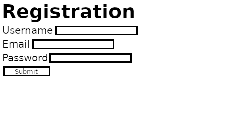

# 2.2.2 Cycle 2: Login/registration pages

## Design

In this second cycle, I will be writing the HTML pages for user login and registration, making use of the form element. I will later be connecting this with my back-end to facilitate registration of new accounts and authentication of existing accounts using sqlite3 for storing and bcrypt for hashing passwords so they can be stored securely.

I will not be implementing any CSS design in this cycle in order to save time, however if I have time at the end I will add CSS.

### Objectives

* [x] Write HTML login page with username and password fields
* [x] Write HTML registration page with username, email, and password fields
* [x] Test form submission

### Usability Features

### Page design plan

<figure><figcaption><p>Plan for registration form</p></figcaption></figure>

<figure><figcaption><p>Plan for login form</p></figcaption></figure>

## Development

### Outcome

At the end of this cycle, I have written HTML pages for user login and user registration that will be used in the accounts system of my game.&#x20;

Below is the code for the body of my registration form:

```html
<h1>Registration</h1>
<form>
    <fieldset>
        <label for="username">Username</label>
        <input type="text" name="username" id="username" minlength=4 required>
    </fieldset>
    <fieldset>
        <label for="email">Email</label>
        <input type="email" name="email" id="email" required>
    </fieldset>
    <fieldset>
        <label for="password">Password</label>
        <input type="password" name="password" id="password" minlength=8 required>
    </fieldset>
    <input type="submit" value="Submit">
</form>
```

Below is the code for the body of my login form:

```html
<h1>Login</h1>
<form>
    <fieldset>
        <label for="username">Username</label>
        <input type="text" name="username" id="username"required>
    </fieldset>
    <fieldset>
        <label for="password">Password</label>
        <input type="password" name="password" id="password" required>
    </fieldset>
    <input type="submit" value="Submit">
</form>
```

### Challenges

I have used HTML forms before, so I did not encounter any challenges in this design cycle.

## Testing

Evidence for testing

### Tests

<table><thead><tr><th width="95">Test</th><th width="158">Instructions</th><th width="171">What I expect</th><th width="174">What actually happens</th><th>Pass/Fail</th></tr></thead><tbody><tr><td>1</td><td>Display forms allowing the user to enter and submit their username, password, and email (if registering)</td><td>Login and registration forms allow user to enter their details and submit the form.</td><td>As expected</td><td>Pass</td></tr></tbody></table>

### Evidence

<figure><figcaption><p>Registration page</p></figcaption></figure>

<figure><figcaption><p>Login page</p></figcaption></figure>

<figure><figcaption><p>Successful submission</p></figcaption></figure>
