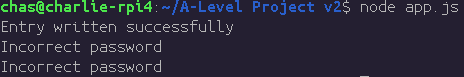

# 2.2.3 Cycle 3: Hashing passwords with bcrypt

## Design

In this third cycle, I will be testing the Node.js implementation of hashing algorithm bcrypt. This will be used later on to store passwords and authenticate the user in the SQLite database, since it is more secure than storing it in plaintext where it could be obtained by a hacker.&#x20;

### Objectives

* [x] Write a new entry to my users table with the password hashed
* [ ] Compare passwords with the one in the database to see if they are valid

### Usability Features

### Key Variables

| Variable Name | Use                           |
| ------------- | ----------------------------- |
| hash          | Store hashed output of string |

### Pseudocode

```
// Import SQLite3 and bcrypt modules
import sqlite3, bcrypt

// Open SQLite database
db = sqlite3.open("data.db")

// Hash password and insert it into users table with user 'charlie2'
password = bcrypt.hash(salt=10, 'password123')
db.run(`INSERT INTO users (username, password) VALUES ('charlie2', '[password]')`)

// Query entry with wrong password
password = bcrypt.hash(salt=10, '321drowssap')
details_valid = db.get(`SELECT * FROM users WHERE username='charlie2' AND password='[password]'`)
print(details_valid) // Should print false

// Query entry with correct password
password = bcrypt.hash(salt=10, 'password123')
details_valid = db.get(`SELECT * FROM users WHERE username='charlie2' AND password='[password]'`)
print(details_valid) // Should print user details
```

## Development

### Challenges

I found the Node.js implementation of the bcrypt algorithm very challenging to get the hang of and have decided I will not be using it in my project. While this means passwords will be stored in plaintext, creating a potential security risk in large-scale applications, I heavily doubt my game will be targeted by hackers as they have no motive.

## Testing

Evidence for testing

### Tests

<table><thead><tr><th width="95">Test</th><th width="158">Instructions</th><th width="171">What I expect</th><th width="174">What actually happens</th><th>Pass/Fail</th></tr></thead><tbody><tr><td>1</td><td>Write hashed test entry to the users table.</td><td>Test entry with hashed password in the "users" table of database.</td><td><p>As expected</p><p>The test entry is successfully written to the users table but due to the asynchronous nature of the bcrypt and sqlite3 library, the password checks run at the same time and therefore, they both return "incorrect" because the entry does not exist in the users table yet.</p></td><td>Pass</td></tr><tr><td>2</td><td>Use SQL queries to compare two plaintext passwords to the test entry, one password is wrong and the other is right.</td><td>The console outputs "correct" for the right password and "incorrect" for the wrong password.</td><td>Both password checks return "incorrect" because they are running at the same time since the Node.js implementation of bcrypt is asynchronous.</td><td>Fail</td></tr><tr><td>3</td><td>Wrap SQL queries to compare passwords in callbacks so the code waits until each task is finished before moving to the next.</td><td>The console outputs "correct" for the right password and "incorrect" for the wrong password.</td><td>Same as before, after debugging I find bcrypt is generating a different hash for the same password.</td><td>Fail</td></tr></tbody></table>

### Evidence

<figure><figcaption><p>First test -- entry written successfully</p></figcaption></figure>

<figure><figcaption><p>Second test (fail)</p></figcaption></figure>
