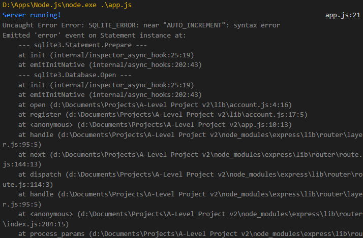
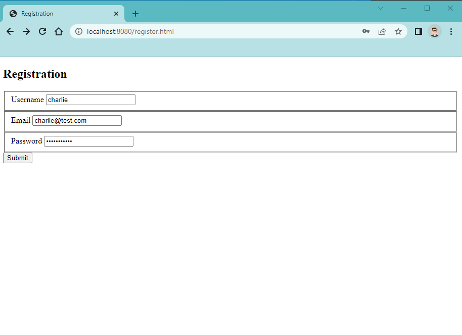

# 2.2.6 Cycle 6: Working registration form

## Design

In this cycle, I will be be combining the registration form from [Cycle 2](cycle-2.md) with elements of other previous cycles to create a working registration form that allows the user to enter their username, email, and password to create an account. To prevent conflicts, the server must check if an account is already registered with the given username before proceeding with registration.

### Objectives

* [x] Create a SQLite database with an automatically generated unique numeric ID, username, email, password, and record fields.
* [x] Validate username submitted in registration form to ensure it does not already exist.
* [x] Insert entry containing submitted data to the users table.
* [x] Redirect the user to the login form if successful.
* [x] If an error occurs, display the error on a separate page to the user.

### Usability Features

### Key Variables

| Variable Name | Use |
| ------------- | --- |
|               |     |

### Pseudocode


```
// Import SQLite3 module for read/write to database
import sqlite3

// Callback function to create/open DB and create users table
function open (callback):
    db = sqlite3.open("data.db")
    db.run(`CREATE TABLE IF NOT EXISTS users (
        id INTEGER NOT NULL AUTO_INCREMENT,
        username TEXT NOT NULL UNIQUE,
        email TEXT NOT NULL,
        password TEXT NOT NULL,
        record INT,
        PRIMARY KEY (id)
    )`)
    callback(db)

// Register function to check if username is taken and if not create new account
function register (form, callback):
    open((db) : 
        // Get details submitted in form
        username = form.username
        email = form.email
        password = form.password
    
        // Check if username is already in use
        username_exists = db.get(`SELECT * FROM users WHERE username=[username]`)
        if username_exists: // Username taken
            callback(409) // Return 409 -- error code for "conflict"
        else:
            // Insert entry into users table
            db.run(`INSERT INTO users (username, email, password) VALUES ([username], [email], [password])`)
            catch err:
                callback(err) // SQL error occurs
            no err:
                callback(false)
    )

export(register) // Register function can be imported from module
```



```
// Import account module
import lib/account

// Setup Express app
app = express()
app.public_dir("/public")

// Handle POST request "/register"
app.receive_post_req('/register', (req, res) :
    // Run register function
    account.register(form=req.body, (err): 
        if err:
            res.send_error(err) // Display error message to client
        else:
            redirect("login.html") // Redirect to login page

app.run(port=8080)
```


## Development

### Outcome


### Challenges

My initial test failed because of a syntax error in the code to create the users table. The SQL query attempted to create a field "id" with the property "AUTO\_INCREMENT" so the number would increase on its own for each account made -- I didn't realise I didn't need the underscore. After modifying the query to use AUTO\_INCREMENT and set "id" as the primary key on the same line, the table was successfully created.

Original SQL query that caused a syntax error:

```sql
CREATE TABLE IF NOT EXISTS users (
        id INTEGER AUTO_INCREMENT,
        username TEXT NOT NULL UNIQUE,
        email TEXT NOT NULL,
        password TEXT NOT NULL,
        record INT,
        PRIMARY KEY (id)
)
```

Updated query that was successful:

```sql
CREATE TABLE IF NOT EXISTS users (
        id INTEGER PRIMARY KEY AUTOINCREMENT,
        username TEXT NOT NULL UNIQUE,
        email TEXT NOT NULL,
        password TEXT NOT NULL,
        record INT
)
```

## Testing

Evidence for testing

### Tests

<table><thead><tr><th width="95">Test</th><th width="158">Instructions</th><th width="171">What I expect</th><th width="174">What actually happens</th><th>Pass/Fail</th></tr></thead><tbody><tr><td>1</td><td>Register account using form input</td><td>Registration succeeds and the browser is redirected to the login form.</td><td>SQLite3 syntax error when creating table near "AUTO_INCREMENT"</td><td>Fail</td></tr><tr><td>2</td><td>Register account using form input</td><td>Registration succeeds and the browser is redirected to the login form.</td><td>As expected</td><td>Pass</td></tr></tbody></table>

### Evidence

<figure><figcaption><p>Syntax error on test 1</p></figcaption></figure>

<figure><figcaption><p>Registration form with test data</p></figcaption></figure>

<figure><figcaption><p>On success, the browser is redirected to the login form</p></figcaption></figure>

<figure><figcaption><p>Test entry written into users table of database</p></figcaption></figure>

<figure><figcaption><p>Error when attempting to register a username already in use</p></figcaption></figure>
