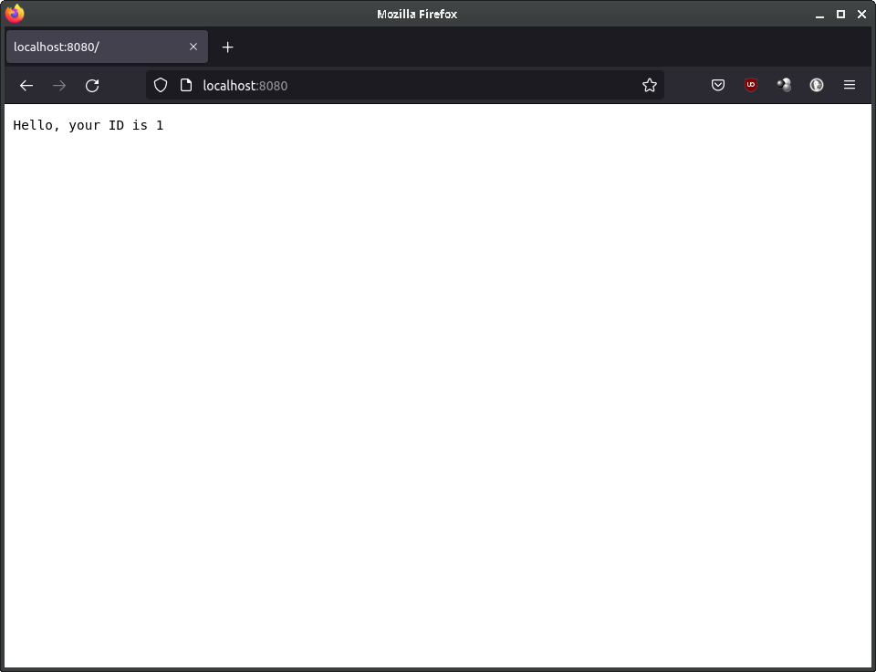
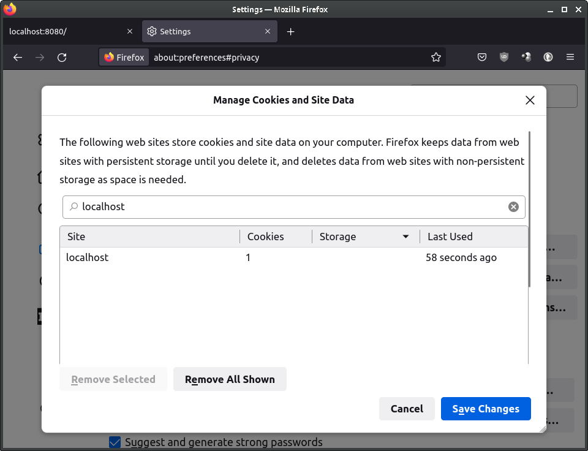
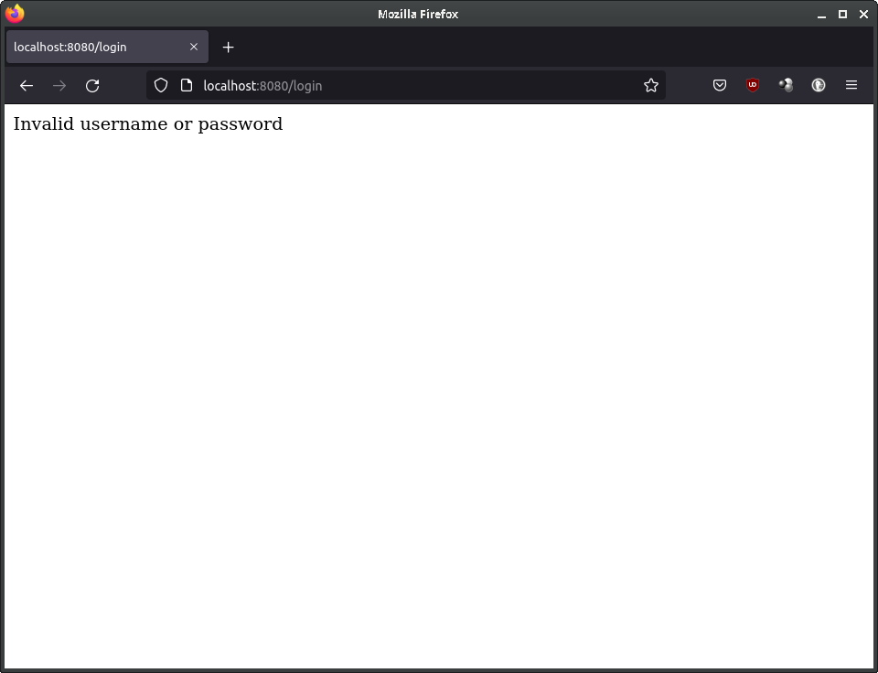

# 2.2.7 Cycle 7: Working login

## Design

In this cycle, I will be combining the login form created in [Cycle 2](cycle-2.md) with the ability to save and read cookies demonstrated in [Cycle 5](cycle-5.md) to create a working login form that authenticates user details and saves the user ID in a cookie.&#x20;

### Objectives

* [x] Check for a matching entry in database based on submitted username and password.
* [x] Save numeric ID in cookie that can be read from later.
* [x] Display message if login successful with ID loaded from cookie.
* [x] Display error if login unsuccessful, for example if invalid credentials were entered.

### Usability Features

### Key Variables

| Variable Name | Use                                                                      |
| ------------- | ------------------------------------------------------------------------ |
| cookieParser  | Middleware to allow Express.js to read and write to cookies in requests. |
| db            | Facilitate read/write operations to external database                    |
| err           | Store errors that may occur on executing SQL queries                     |
| row.id        | Numeric identifier used to distinguish between user accounts             |
| login         | Function to authenticate user credentials                                |

### Pseudocode


```
// Login function to verify user credentials
function login (form, callback):
    open(db):
        // Get submitted details
        username = form.username
        password = form.password
        
        // Check if account with those credentials exists
        valid_credentials = db.get("SELECT * FROM users WHERE username=[username] AND password=[password]")
        if valid_credentials: // Account does exist, therefore credentials valid
            callback(false, valid_credentials.data.id)
        else if error: // SQL-related error
            callback(error)
        else: // Entry not found, so invalid credentials
            callback(401) // Unauthorised
            
export(register, login) // Login function can be imported
```



```
// Handle POST request "/login"
app.receive_post_req('/login', (req, res):
    // Run login function
    account.login(form=req.body, (err, id):
        if err:
            res.send_err(err)
        else: // Login successful
            res.cookieSet('id', id) // Set cookie with ID
            redirect('/') // Redirect to index page
        res.done() // Finish

// Handle GET request "/"
app.receive_get_req('/', (req, res):
    id = req.cookies.id // Get ID stored in cookie
    
    // If nothing is set in the cookie, redirect client to login
    if id undefined:
        redirect("login.html")
    
    res.end("Hello, your ID is" + id) // Display ID to user in plaintext
```


## Development

### Outcome

At the end of this cycle, I have finished development of the login system and can now move on to developing the game's leaderboard. I have allowed the player to sign in or create a new account, and tested the ability of the Express.js library and the cookie-parser middleware to read and write cookies, which will be used in my game to verify if the player is signed in or not to access various functionality such as the multiplayer, and obtaining additional data about the user such as their record time and their username.

I stored my login function in the same "account" library as the registration function I wrote in [Cycle 6](cycle-6.md#pseudocode). This makes it easier to understand the different parts of my game, for example if I encountered a bug in the future relating to the login system I would easily be able to narrow down potential causes.&#x20;

Like the register function, I started off my login by opening the database and storing the values for username and password in their own variables.


```javascript
function login(form, callback) {
    open((db) => {
        const username = form.username
        const password = form.password
```


Next, the login function must verify that both the username and password submitted actually match an account. I implemented this through executing a SQL SELECT query. The function checks for an entry where the username and passwords fields match those submitted. If such an entry is found, it returns the ID obtained in the query. Otherwise, if a SQL error occurs or no entry was found, it returns an error code and message.


```javascript
db.get(`SELECT * FROM users WHERE username='${username}' AND password='${password}'`, (err, row) => {
    if (row) {
        callback(false, row.id)
    } else if (err) {
        callback({
            code: 500,
            msg: "Internal database error"
        })
    } else {
        callback({
            code: 401,
            msg: "Invalid username or password"
        })
    }
})
```


In the main file, I started by importing and enabling the "cookie-parser" middleware which allows the server to read data from cookies.


```javascript
const cookieParser = require('cookie-parser')
app.use(cookieParser())
```


On receiving a POST request at /login, the request body is passed in to the login function. If an error occurs, its status code and message will be sent as the response to the client. If the registration is successful, the ID returned in the login function will be stored in a cookie and the client will be redirected to the root page of the server.


```javascript
account.login(req.body, (err, id) => {
    if (err) {
        res.status(err.code).send(err.msg)
    } else {
        res.cookie('id', id)
        res.redirect("/")
    }
    res.end()
})
```


Finally, the server handles the GET request to the root page of the site. This is what is shown to the user when they go to the site address in a web browser. For this cycle, I just want the ID stored in the cookie to be displayed to confirm it can be read from. If the cookie lacks a value, meaning the user is not signed in, they are redirected to the login page; otherwise, the cookie's value is displayed in plaintext.


```javascript
app.get('/', (req, res) => {
    const id = req.cookies.id

    if (id === undefined) {
        res.redirect("login.html")
    } else {
        res.end("Hello, your ID is " + id)
    }
})
```


### Challenges

The server crashed on my first test when attempting to access the site from my browser. On further investigation, this appeared to be caused by how I implemented handling of the "GET" request to the site's root page.


```javascript
const id = req.cookies.id

if (id === undefined) {
    res.redirect("login.html")
}

res.end("Hello, your ID is " + id)
```


In the above code, the server checks if the value for the "id" cookie is undefined, which would mean the user is not signed in. If it is such, it redirects the client to the login form. I thought I did not need to use an else statement with the alternative scenario, which is that the cookie had a set value and to display it to the client. However, I was wrong, because the error I got on the crash indicated that the server attempted to send another response after the request was "ended" by the redirect function.&#x20;

To fix this, I implemented an "else" statement to handle the scenario in which a value was saved in the cookie:


```javascript
const id = req.cookies.id

if (id === undefined) {
    res.redirect("login.html")
} else {
    res.end("Hello, your ID is " + id)
}
```


## Testing

Evidence for testing

### Tests

<table><thead><tr><th width="95">Test</th><th width="158">Instructions</th><th width="171">What I expect</th><th width="174">What actually happens</th><th>Pass/Fail</th></tr></thead><tbody><tr><td>1</td><td>Redirect client to root page if there is no "id" cookie.</td><td>Browser redirected to login page.</td><td>Server crashes with uncaught error "ERR_STREAM_WRITE_AFTER_END"</td><td>Fail</td></tr><tr><td>2</td><td>Redirect client to root page if there is no "id" cookie. Updated code uses "else" statement for if cookie has a set value.</td><td>Browser redirected to login page.</td><td>As expected</td><td>Pass</td></tr><tr><td>3</td><td>Submit username and password registered in the previous cycle.</td><td>Browser redirected to page displaying ID.</td><td>As expected</td><td>Pass</td></tr><tr><td>4</td><td>Submit intentionally wrong username and password</td><td>Error shown in browser</td><td>As expected</td><td>Pass</td></tr></tbody></table>

### Evidence

<figure><figcaption><p>ERR_STREAM_WRITE_AFTER_END on test 1</p></figcaption></figure>

<figure><figcaption><p>Redirected to login form on test 2</p></figcaption></figure>

<figure><figcaption><p>Page displaying ID of user account on form submission in test 3</p></figcaption></figure>

<figure><figcaption><p>Cookie saved for "localhost"</p></figcaption></figure>

<figure><figcaption><p>Test 4 -- browser displays message if invalid details are submitted</p></figcaption></figure>
